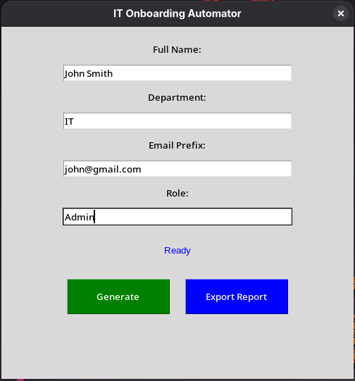

# IT Onboarding Automator
A small Python tool with a simple GUI that automatically generates usernames and passwords for new employees and saves them to a CSV file.

## Screenshot

## Why I Built This
While working in IT support, I noticed how much time we wasted manually creating user accounts, generating passwords, and logging them in spreadsheets. I built this as a beginner Python project to practice GUI development with tkinter, CSV file handling, and basic logging. My goal was to turn a repetitive manual task into a simple click-and-go process, while learning how to structure a small automation script from scratch.

## What It Does
- Opens a small window where you can type in a new employee's name, department, email prefix, and job role
- Click "Generate" to automatically create a temporary username (adds "temp_" to the email prefix) and a random 12-character password
- Saves everything to a CSV file called `onboarding_records.csv` so you can track all accounts in one place
- Logs every action to `audit.log` with timestamps, which helps when you need to check what happened later
- Click "Export Report" to create a simple markdown summary file that shows all users without exposing their passwords

## Tech Used
- `tkinter` - for the GUI window and buttons
- `csv` - for reading and writing the data file
- `logging` - for keeping an audit trail
- `datetime` - for timestamps
- `secrets` - for better random password generation
- `string` - for character sets in passwords
- `os` - for checking if files exist

## How to Run It
1. Make sure you have Python 3 installed (type `python3 --version` in terminal to check)
2. Download this folder and open a terminal inside it
3. Run `python3 it_onboarding.py` and the GUI window will appear
4. Fill in the fields and click "Generate" to create a user account

## Important Notes
This is my first real automation project, so keep a few things in mind:
- Passwords are saved in plain text in the CSV file, which is fine for practicing but not safe for real employee data
- There's no login system or password protection - anyone who opens the CSV can see everything
- I'm using this to learn, not for actual production use at work

## What I'm Learning Next
I want to add password hashing with bcrypt so passwords aren't stored as plain text anymore. I also might try exporting to Excel format since that's what my team actually uses for tracking new hires.

## License
MIT License

Copyright (c) 2026 Mazen

Permission is hereby granted, free of charge, to any person obtaining a copy of this software and associated documentation files (the "Software"), to deal in the Software without restriction, including without limitation the rights to use, copy, modify, merge, publish, distribute, sublicense, and/or sell copies of the Software, and to permit persons to whom the Software is furnished to do so, subject to the following conditions:

The above copyright notice and this permission notice shall be included in all copies or substantial portions of the Software.

THE SOFTWARE IS PROVIDED "AS IS", WITHOUT WARRANTY OF ANY KIND, EXPRESS OR IMPLIED, INCLUDING BUT NOT LIMITED TO THE WARRANTIES OF MERCHANTABILITY, FITNESS FOR A PARTICULAR PURPOSE AND NONINFRINGEMENT. IN NO EVENT SHALL THE AUTHORS OR COPYRIGHT HOLDERS BE LIABLE FOR ANY CLAIM, DAMAGES OR OTHER LIABILITY, WHETHER IN AN ACTION OF CONTRACT, TORT OR OTHERWISE, ARISING FROM, OUT OF OR IN CONNECTION WITH THE SOFTWARE OR THE USE OR OTHER DEALINGS IN THE SOFTWARE.

## Author
Mazen | m.alachek@outlook.com
